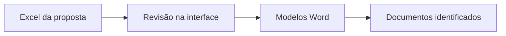

<div align="center">

# DocsPropostas
### Do Excel aos documentos da proposta, num único fluxo.

**Engenharia civil · Orçamentação · Preparação documental**

Reutilize os dados da empreitada, reveja a informação e gere documentos Word a partir dos seus próprios modelos.

[Começar](#começar-em-poucos-passos) · [Guia de utilização](docs/CONFIGURACAO.md) · [Formato Excel e modelos](docs/FORMATOS.md)

</div>

---

## Nova edição configurável — piloto

Inclui **Definições**, perfis partilháveis, mapeamento visual de Excel, campos personalizados e catálogo de habilitações editável. O **Padrão Marcos** preserva as associações originais. [Configurar o seu modelo](docs/CONFIGURACAO.md).

## Mais tempo para preparar a proposta

Numa proposta de empreitada, a mesma referência, designação, localização e prazo aparecem em vários documentos. O DocsPropostas reúne esses dados numa interface e aplica-os aos modelos Word escolhidos.

É uma ferramenta de apoio a engenheiros, orçamentistas e equipas de preparação de concursos que trabalham com Excel e Word e pretendem reduzir o preenchimento repetitivo.

## O que pode fazer

| Funcionalidade | Aplicação prática |
| --- | --- |
| **Importar dados Excel** | Ler os campos da folha `Doc Proposta` e a lista de documentos. |
| **Rever antes de gerar** | Editar referência, empreitada, local, prazo e documentos diretamente na interface. |
| **Organizar habilitações** | Selecionar categorias e subcategorias, preencher classes e valores e rever a lista. |
| **Usar os seus modelos Word** | Inserir variáveis nos ficheiros `.docx` e escolher a pasta de modelos. |
| **Gerar vários documentos** | Processar os modelos da pasta numa única operação. |
| **Identificar os ficheiros** | Nomear cada saída com referência interna, modelo e localização. |
| **Acompanhar o processo** | Consultar o registo e a barra de progresso. |
| **Personalizar a experiência** | Alternar tema claro/escuro e guardar preferências de pastas. |

## Como funciona



**Exemplo fictício:** uma proposta `DEMO-001` para um edifício demonstrativo pode alimentar vários modelos — uma apresentação, uma lista de documentos e outros textos preparados pela equipa. O mesmo conjunto de dados é reutilizado em todos eles.

## Começar em poucos passos

Ambiente de referência: **Windows, Python 3.14 com Tkinter**. Os testes de lógica desta edição foram executados nesse ambiente. Não é necessário automatizar o Microsoft Word por COM para gerar os ficheiros.

```powershell
git clone https://github.com/jesuismarcs/DocsPropostas.git
cd DocsPropostas
python -m venv .venv
.venv\Scripts\python.exe -m pip install -r requirements.txt
.venv\Scripts\python.exe examples/create_demo.py
.venv\Scripts\python.exe main.py
```

Na aplicação:

1. Carregue `local/demo/proposta-demo.xlsx`.
2. Escolha `local/demo/modelos` em **Pasta de Modelos**.
3. Defina `local/demo/saida` como pasta de saída.
4. Reveja os dados e clique em **Gerar Documentos**.

O exemplo é criado localmente e contém apenas informação fictícia. Os ficheiros operacionais e modelos da organização não fazem parte deste repositório.

## Modelos fáceis de adaptar

Escreva as variáveis no Word:

```jinja
Empreitada: {{ NOME_DA_EMPREITADA }}
Local: {{ LOCAL_DA_OBRA }}
Prazo: {{ DURACAO_DA_EMPREITADA }} dias
```

O [guia de formatos](docs/FORMATOS.md) descreve todas as variáveis e a estrutura de habilitações. Uma variável inexistente provoca um erro identificado, em vez de ser silenciosamente substituída por texto vazio.

## Estrutura do projeto

```text
DocsPropostas/
├── main.py                 # Arranque da aplicação
├── src/docspropostas/      # Interface, leitura e geração
├── docs/                   # Utilização, formatos e análise técnica
├── examples/create_demo.py # Excel e Word fictícios
├── tests/                  # Testes locais de geração
├── requirements.txt        # Dependências da aplicação
└── .env.example            # Configuração opcional
```

## Qualidade e limites

- Geração DOCX, preservação de caracteres especiais, variáveis em falta e proteção contra sobrescrita cobertas por testes.
- Classes de alvará empresariais removidas: são preenchidas pelo utilizador. O catálogo é uma base de seleção, não uma validação de habilitações.
- A aplicação não calcula preços nem certifica conformidade documental; os documentos finais devem ser revistos.
- Todos os modelos são preparados numa pasta temporária antes da publicação; ficheiros existentes são preservados.
- Não inclui modelos contratuais, assinatura digital, exportação PDF ou executável pré-compilado.
- Construção da interface e das definições verificada localmente; utilização integral com modelos de terceiros ainda requer validação piloto.

[Testes e análise técnica](docs/ANALISE-TECNICA.md) · [Alterações desta edição](CHANGELOG.md)

**Desenvolvido por [Marcos Santos](https://github.com/jesuismarcs), no contexto da engenharia civil e orçamentação.**

